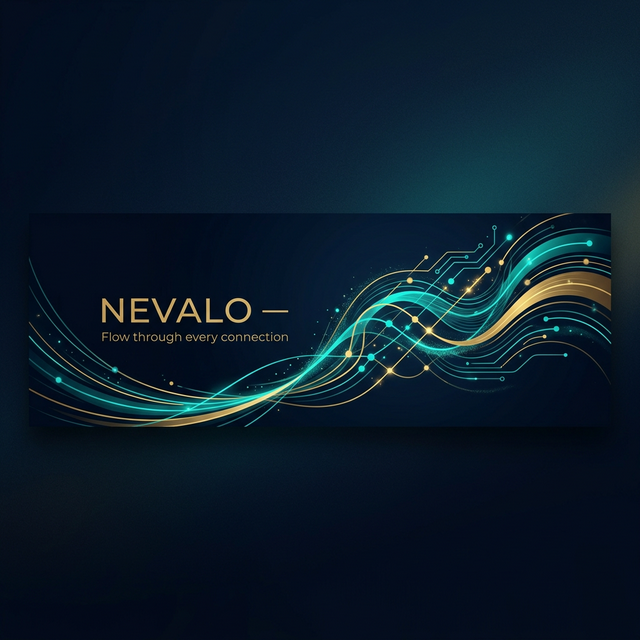

# Olá, eu sou Welder Barroso! 👋
### Fundador da [Nevalo](https://nevalo.dev) · Desenvolvedor Software Humanizado

*"Flow through every connection."*

[PT-BR] · [EN](#english-version)

---

## 🚀 Sobre Mim & Nevalo

Sou técnico em TI formado pelo IFRR e atualmente atuo como Desenvolvedor Frontend e fundador da **Nevalo**. 

A Nevalo não é apenas uma empresa de software; é uma filosofia de **tecnologia humana**. Acreditamos que o software deve ser flexível, fluido e, acima de tudo, conectar pessoas de forma genuína. Cada linha de código que escrevo carrega o compromisso de criar experiências que não apenas funcionam, mas encantam.

- 🌵 Localizado em **Roraima, Brasil**.
- 🛠️ Especialista em **React, Next.js e Ecossistema JavaScript**.
- 🎨 Criador do **Nevalo Design System**.
- 🤝 Focado em transformar problemas complexos em interfaces simples e elegantes.

---

## 🛠️ Stack Tecnológica

| Especialidade | Tecnologias |
| :--- | :--- |
| **Frontend** | React, Next.js, Vite, TypeScript, Styled-Components, Tailwind CSS |
| **Mobile** | React Native |
| **Backend / Infra** | Firebase (Firestore, Auth, Storage, Hosting), Node.js |
| **Design / Tools** | Figma, Nevalo Design System, Git, Yarn/NPM |

---

## 🌟 Projetos em Destaque

| Projeto | Descrição | Stack |
| :--- | :--- | :--- |
| [**Mix Webapp**](https://github.com/WelderBM/mix-webapp) | Plataforma E-commerce Full Stack com personalização de produtos. | Next.js, Firebase, Zustand |
| [**JL Skull Barber**](https://github.com/WelderBM/jl_skull_barber_site) | Sistema de agendamento real para barbearia com painel administrativo. | Vanilla JS, Firebase |
| [**Nevalo DS**](https://github.com/WelderBM/design-system) | O núcleo visual da minha marca. Tokens, componentes e filosofia. | CSS Puro, HTML5 |
| [**BurgerApp**](https://github.com/WelderBM/BurgerApp) | App de delivery com gestão completa de pedidos e navegação fluida. | React, Styled-Components |

---

## 📫 Vamos Conversar?

Se você tem um projeto desafiador ou quer apenas trocar uma ideia sobre tecnologia e design, estou à disposição.

- 📧 **Email:** [welderbarroso.dev@gmail.com](mailto:welderbarroso.dev@gmail.com)
- 📱 **WhatsApp:** [+55 (95) 98400-6377](https://wa.me/5595984006377)
- 🪐 **Web site:** [nevalo.dev](https://nevalo.dev)

---

 

# Hello, I'm Welder Barroso! 👋
### Founder of [Nevalo](https://nevalo.dev) · Humanized Software Developer

*"Flow through every connection."*

---

## 🚀 About Me & Nevalo

I'm an IT technician and frontend developer based in Roraima, Brazil. As the founder of **Nevalo**, I strive to build software that feels human. My focus is on creating fluid, flexible connections between technology and people.

- 🛠️ Specialized in **React, Next.js, and JavaScript ecosystem**.
- 🎨 Creator of the **Nevalo Design System**.
- 🤝 Passionate about turning complex business needs into elegant user interfaces.

---

## 🛠️ Tech Stack

- **Core:** JavaScript (ES6+), TypeScript, React, Next.js.
- **Styling:** Styled-Components, Tailwind CSS, Vanilla CSS.
- **Backend:** Firebase Services (Full sync), Node.js basics.
- **Workflow:** Figma, Git/GitHub, Agile mindsets.

---

## 📫 Get in Touch

- 📧 **Email:** [welderbarroso.dev@gmail.com](mailto:welderbarroso.dev@gmail.com)
- 📱 **WhatsApp:** [+55 (95) 98400-6377](https://wa.me/5595984006377)
- 🔗 **LinkedIn:** [Welder Barroso](https://linkedin.com/in/welder-barroso-37b654207)

---

Tecnologia com alma · Technology with soul · <a href="https://nevalo.dev">nevalo.dev</a>

